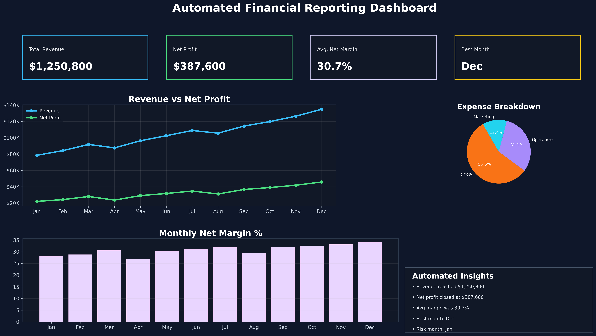

# Automated Financial Reporting

Python automation project for financial analysis, dashboard generation, Excel summaries and PDF reporting.

## Features

- Financial data analysis with Pandas
- Automated KPI calculations
- Financial dashboard generation
- Excel summary export
- Automated PDF report creation
- Business performance insights

## Technologies

- Python
- Pandas
- Matplotlib
- FPDF
- OpenPyXL

## Preview

### Financial Dashboard

## Project Workflow

1. Load financial dataset
2. Clean and process data
3. Calculate key financial metrics
4. Generate dashboard visualization
5. Export Excel summary
6. Generate PDF report

## Author

JG Automation & Data
